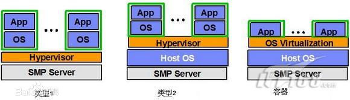

# 1-虚拟化与容器技术

[TOC]

## 虚拟化与容器技术分类

虚拟化技术主要分为三个类型

- I型虚拟机：裸机型、虚拟机直接运行在系统硬件上，Hypervisor直接管理调用硬件资源，不需要底层操作系统。
- II型虚拟机：宿主型、虚拟机运行在传统操作系统上，构建出一套虚拟硬件平台，可在其上安装操作系统。
- III型虚拟机：容器/操作系统虚拟化、在传统操作系统上创建一个独立的容器，对操作系统的资源进行划分，所有程序的运行都由底层操作系统负责。

性能区别：理论上3型>1型>2型。

1型与2型是虚拟化出了一套硬件、而3型还是依赖于操作系统去运行，所以1、2型都可以安装其他操作系统，而3型不仅不能安装操作系统还只能运行底层操作系统支持的程序。

## Linux的虚拟化与容器化技术

### KVM

**KVM-全称是基于内核的虚拟机（Kernel-based Virtual Machine）**

​		KVM是一个开源软件，基于内核的虚拟化技术，是嵌入Linux的一个虚拟化模块，通过优化内核来使用虚拟技术，该内核模块使得 Linux 变成了一个Hypervisor，虚拟机使用 Linux 自身的调度器进行管理。
​		KVM是基于虚拟化扩展（Intel VT 或者 AMD-V）的 X86 硬件的开源的 Linux 原生的全虚拟化解决方案。KVM 中，虚拟机被实现为常规的 Linux 进程，由标准 Linux 调度程序进行调度；虚拟机的每个虚拟 CPU 被实现为一个Linux 进程。这使得KVM能够使用 Linux 内核的已有功能。KVM 本身不执行任何硬件模拟，需要客户空间程序设置一个客户机虚拟服务器的地址空间，向它提供模拟的 I/O。

### LXC

**LXC-全称是linux容器（Linux Container）**

​		LXC可以提供轻量级的虚拟化，以便隔离进程和资源，而且不需要提供指令解释机制以及全虚拟化的其他复杂性。

​		LXC使用Linux中的Cgroup与Namespace做到有效地将由单个操作系统管理的资源划分到多个孤立的组中，以及更好地在孤立的组之间平衡资源的使用需求。

### 总结

KVM属于2型虚拟机。

LXC属于3型虚拟机。