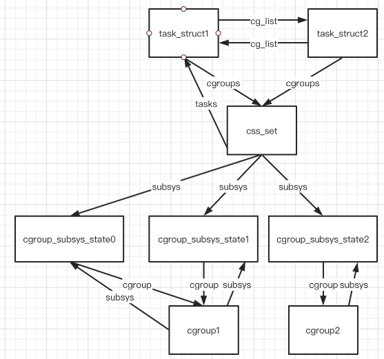
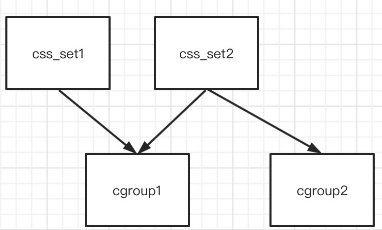
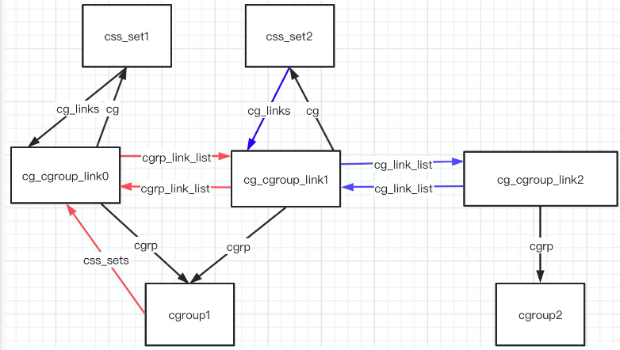
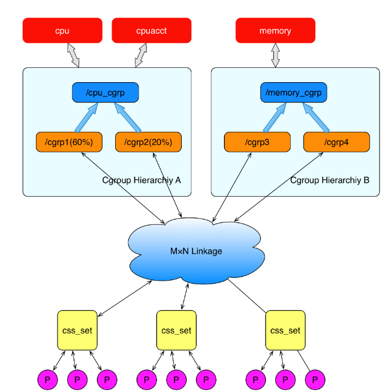

# 2-Dokcer原理之Cgroups

[TOC]

## 简介

Cgroups，其名称为控制组群（Control Groups），是LInux内核提供的一个功能，用来限制、控制和分离一个进程组的资源（如CPU、内存、磁盘输入输出等）。

Cgroups提供了以下这些功能：

- **资源限制：**组可以被设置不超过设定的内存限制；这也包括虚拟内存。
- **优先级：**一些组可能会得到大量的CPU或磁盘IO吞吐量。
- **结算：**用来衡量系统确实把多少资源用到适合的目的上。
- **控制：**冻结组或检查点和重启动。

## 概念

- **任务（task）**：在cgroup中任务就是一个进程。
- **控制组（cgroup）**：用于控制一组特定进程对资源的使用。
- **层级树（hierarchy）**：多个cgroup构成的树，一个层级数存在一个父cgroup节点，其他子cgroup继承父cgroup的特定属性，层级树上的关系通过cgroupfs虚拟文件系统来显示与控制。
- **子系统（subsystem）**：通过cgroup提供的工具和接口来管理进程集合的模块，一个子系统就是一个资源控制器，用于调度资源和控制资源的使用上限。比如内存子系统，cpu子系统等。
- **cgroupfs**：虚拟文件系统，对cgroup与层级数的一层封装，是用户管理cgroup的主要接口，通过在cgroupfs中创建目录实现对cgroup的创建，通过向目录中写入内容来设置对此cgroup的资源访问控制，向其下task文件写入进程id来将进程绑定到某一cgroup上。

### 相互关系

1. 每次创建新层级树时，该系统中的所有task都是该层级树的默认cgroup的初始成员。（默认cgroup称作root cgroup，是创建层级树时自动创建的，后面创建的cgorup都是此cgroup的后代）
2. 一个子系统最多附加到一个层级树上。
3. 一个层级树可以附加多个子系统。
4. 一个任务可以是多个cgroup的成员，但是这些cgroup不能在同一层级树上。
5. 进程创建子进程时，该子进程默认成为父进程所在cgroup的成员，可以根据需要在之后移动。
6. 一个层级树上的子系统可以通过不同cgroup内的subsystem参数对其进行限额。

## 结构

### 结构体

#### task_struct

```cpp
struct task_struct {
    struct css_set *cgroups;
    //连接到同一css_set的task_struct组成链表
    struct list_head cg_list;
}
```

#### css_set

```cpp
struct css_set { 
    //被task引用的引用数
    atomic_t refcount;
    //用于将css_set组成一个hash表，供内核快速定位css_set
    struct hlist_node hlist; 
    //指向链接到此css_set的task_struct的链表
    struct list_head tasks; 
    //指向一个由cg_cgroup_link中cg_link_list连成的链表
    struct list_head cg_links; 
    //此css_set与多个子系统的链接
    struct cgroup_subsys_state *subsys[CGROUP_SUBSYS_COUNT]; 
    struct rcu_head rcu_head; 
};
```

#### cgroup_subsys_state

```cpp
struct cgroup_subsys_state { 
    //指向了一个cgroup
    struct cgroup *cgroup; 
    atomic_t refcnt; 
    unsigned long flags; 
    struct css_id *id; 
};
```

#### cgroup

```cpp
struct cgroup { 
    unsigned long flags; 
    atomic_t count; 
    struct list_head sibling; //兄弟节点
    struct list_head children; //儿子节点
    struct cgroup *parent; //父亲节点
    struct dentry *dentry; 
    //此cgroup与多个子系统的链接
    struct cgroup_subsys_state *subsys[CGROUP_SUBSYS_COUNT]; 
    //指向此cgroup层级树对应的结构体
    struct cgroupfs_root *root;
    struct cgroup *top_cgroup; 
    //指向一个由cg_cgroup_link中cgrp_link_list连成的链表
    struct list_head css_sets; 
    struct list_head release_list; 
    struct list_head pidlists;
    struct mutex pidlist_mutex; 
    struct rcu_head rcu_head; 
    struct list_head event_list; 
    spinlock_t event_list_lock; 
};
```

通过以上三个结构将进程与cgroup链接起来 

task_struct -> css_set -> cgroup_subsys_state -> cgroup

#### cg_cgroup_link

```cpp
struct cg_cgroup_link { 
    //cgroup中css_set指向的链表
    struct list_head cgrp_link_list; 
    // 指向此 cg_cgroup_link 相关的 cgroup
    struct cgroup *cgrp;
    //css_set中cg_links指向的链表
    struct list_head cg_link_list;
    //指向此 cg_cgroup_link 相关的 css_set
    struct css_set *cg; 
};
```

cgroup和css_set 是多对多的关系，须添加一个中间结构来将两者联系起来，这就是cg_cgroup_link的作用

cg_cgroup_link 中的cgrp和cg就是此结构体的联合主键

利用cgrp_link_list和cg_link_list分别构造相应的cg_cgroup_link链表

使得能从cgroup或css_set都可以对其链接的cg_cgroup_link进行遍历查询。

#### cgroupfs_root

```cpp
struct cgroupfs_root { 
    //指向该层级关联的文件系统数据块
    struct super_block *sb; 
    //将要附加到层级的子系统
    unsigned long subsys_bits; 
    //该层级的唯一id
    int hierarchy_id;
    //实际附加到层级的子系统
    unsigned long actual_subsys_bits; 
    struct list_head subsys_list; 
    //指向该层级的根 cgroup
    struct cgroup top_cgroup; 
    //该层级 cgroup 的个数
    int number_of_cgroups;
    //将系统所有的层级连成链表 
    struct list_head root_list; 
    unsigned long flags; 
    char release_agent_path[PATH_MAX]; 
    char name[MAX_CGROUP_ROOT_NAMELEN]; 
};
```

#### 各结构体间的关联

##### task、css_set、cgroup、subsys间的关系



##### cg_cgroup_link如何维护css_set与cgroup的多对多关系

一个css_set可以连接多个cgroup，一个cgroup可以被多个css_set连接。



下图为上图关系在结构体中的链接图，cg_cgroup_link通过蓝色cg_link_list维护同一css_set的cg_cgroup_link链表，通过红色cgrp_link_list维护同一cgroup的cg_cgroup_link链表。



### 关联



（一个进程只属于一个css_set，一个css_set包含多个进程）

（一个css_set可以附加到多个不在同一层级树上的cgroup中，这样同一css_set中的进程就受到同样的资源限制）

（一个子系统只能附加到一个层级树上，一个层级树可以附加多个子系统）

## 子系统

1. cpu 子系统，主要限制进程的 cpu 使用率。
2. cpuacct 子系统，可以统计 cgroups 中的进程的 cpu 使用报告。
3. cpuset 子系统，可以为 cgroups 中的进程分配单独的 cpu 节点或者内存节点。
4. memory 子系统，可以限制进程的 memory 使用量。
5. blkio 子系统，可以限制进程的块设备 io。
6. devices 子系统，可以控制进程能够访问某些设备。
7. net_cls 子系统，可以标记 cgroups 中进程的网络数据包，然后可以使用 tc 模块（traffic control）对数据包进行控制。
8. freezer 子系统，可以挂起或者恢复 cgroups 中的进程。
9. ns 子系统，可以使不同 cgroups 下面的进程使用不同的 namespace。

## cgroupfs

cgroupfs是向用户展示cgroup的hierarchy，通知kernel用户对cgroup改动的窗口。

## 使用

**挂载cpuset和memory子系统：**

​	mount -t cgroup -o cpuset,memory hier1 /sys/fs/cgroup/rg1

**在/sys/fs/cgroup/rg1下面创建新的cgroup：**

​	cd /sys/fs/cgroup/rg1 

​	mkdir my_cgroup

**添加任务进程到cgroup：**

​	echo PID > tasks

**添加任务进程到cgroup**

​	echo PID > tasks

**其他详细操作见**

https://my.oschina.net/u/1262062/blog/2051159

[https://blog.csdn.net/huang987246510/article/details/80820355](https://blog.csdn.net/huang987246510/article/details/80820355?utm_medium=distribute.pc_relevant.none-task-blog-BlogCommendFromMachineLearnPai2-1.compare&depth_1-utm_source=distribute.pc_relevant.none-task-blog-BlogCommendFromMachineLearnPai2-1.compare)